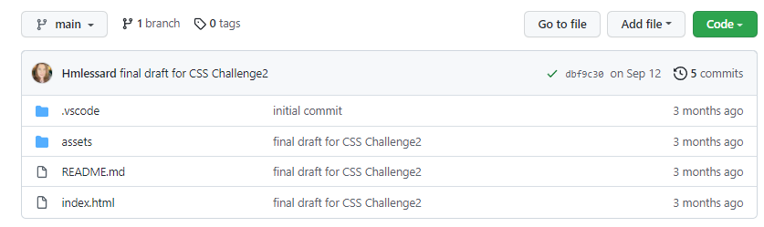
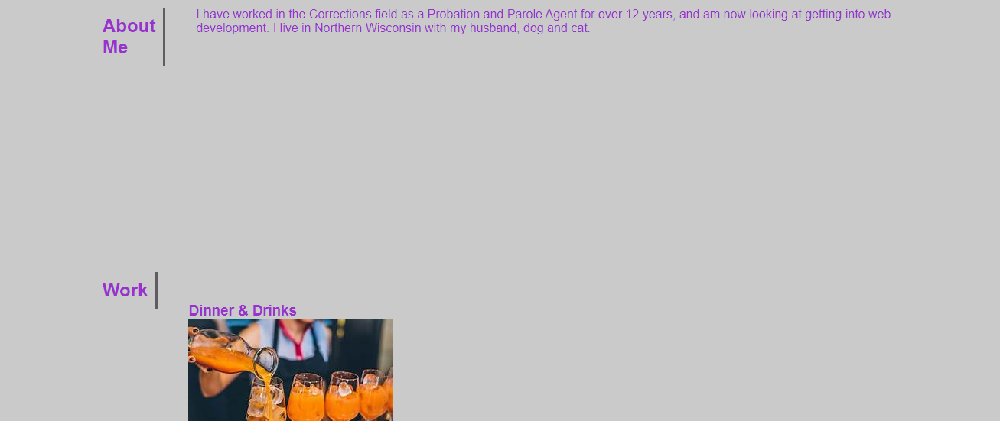
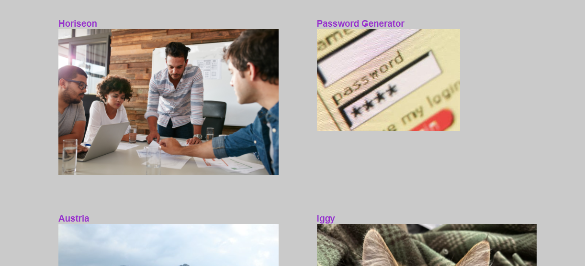
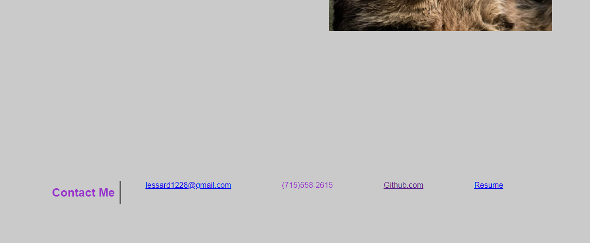

# Personal-Portfolio

## Table of Contents
--------------------

* Introduction
* User Story
* Live Link & Screenshots
* Technologies Used
* Contact Info

## Introduction
---------------

Create a personal portfolio website using HTML and CSS.  The top website should be on a line by itself. Working links to sections and contact info are included.

## User Story
-------------

A personal portfolio that contains my work, and can be updated with more websites.

## Live Link & Screenshots
--------------------------

**View the application here:** [Personal Portfolio](https://hmlessard.github.io/Personal-Portfolio/ "Heather's Portfolio")

**View website screenshots here:**
I was in a prior bootcamp class before transfering to start over.  There is a screenshot of my original repo, but I also updated the code from my original submission and made a new, better named, repo for it.

## Technologies Used
--------------------

* HTML
* CSS

## Contact Info
---------------

If you have any questions about this repo, please feel free to contact me at lessard1228@gmail.com or through GitHub: [Hmlessard](https://github.com/Hmlessard/ "Hmlessard")